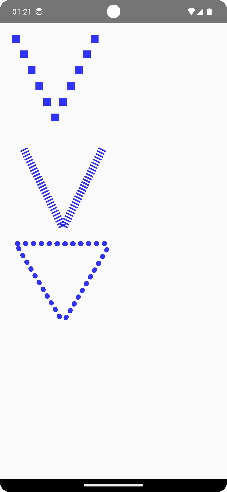
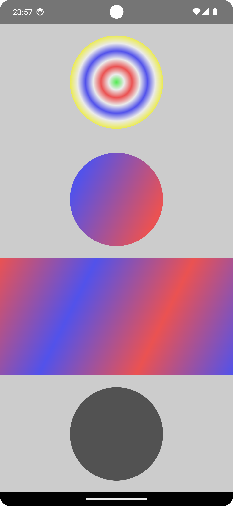

 

 
  ### Canvas with Modifier
  

      &nbsp;&nbsp;&nbsp;
 
   

### Canvas with Class

   &nbsp;&nbsp;&nbsp;
 <H3>Cansda</H3>
      &nbsp;&nbsp;&nbsp;
  

### Canvas with Modifier

   &nbsp;&nbsp;&nbsp;
 
   

 
 

 

  
  Canvas Implementation
 
 Look up the CanvasImplementation.kt
 
  1- Canvas with Modifier
  
<!-- Açıklama veya başlık -->

<!--
first way to change pic size with html code
first way to change  pic size with html code
 
-->
<!-- Resim etiketi -->

  

  2-Canvas with Canvas Class 
  
<!-- Açıklama veya başlık -->
  

  Canvas Shapes
  
  1- DrawPoints
  
  
 

 
 
