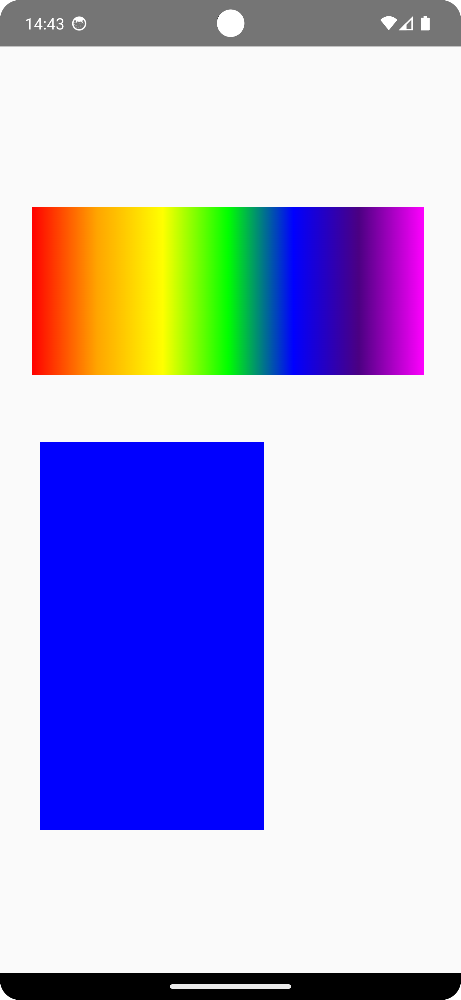

 
 

 

  
 ### Canvas Implementation
 
 Look up the CanvasImplementation.kt
 
  1- Canvas with Modifier
  
<!-- Açıklama veya başlık -->

<!--
first way to change pic size with html code
first way to change  pic size with html code
 
-->
<!-- Resim etiketi -->

  

  2-Canvas with Canvas Class 
  
<!-- Açıklama veya başlık -->
  

 ### Canvas Shapes
  
  1- DrawPoints

  
    
 2- DrawLine
 
 
  
 3- DrawRect
 
 
  4- DrawRoundRect
 
 
  

  

  &nbsp;&nbsp;&nbsp;&nbsp;&nbsp;&nbsp;

 
 
